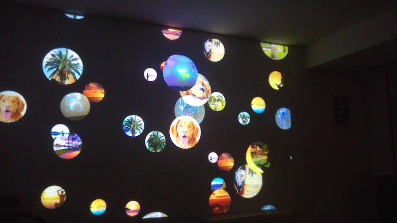

# Bubbles in our heads

Small pixi.js app that shows raising bubbles and a user interface for mobile devices to control the bubbles content.
The user interface allows users to let the serach engine _DuckDuckGo_ find images for the bubbles or upload their own.
Data is transfered via an mqtt server.

### Development / Local Usage

Fill in your mqtt credentials in env.template file.
Remove then the template ending.

```
npm i
npm run watch
```

Then navigate to localhost:8080.
To see the user interface open the devtools and use an mobile useragent (preset) to view the page.

Open Chrome without CORS, otherwise the image search functionality will not work.

When stared locally, you can use also use local images from ./assets/images when using the param local in the url e.g.

```
http://localhost:8080/?local
```

#### Mac

```
open -n -a /Applications/Google\ Chrome.app/Contents/MacOS/Google\ Chrome --args --user-data-dir="/tmp/chrome_dev_test" --disable-web-security
```

#### Windows:

Create a new shortcut with target as

```
"[PATH_TO_CHROME]\chrome.exe" --disable-web-security --disable-gpu --user-data-dir=~/chromeTemp
```

#### Linux:

```
google-chrome --disable-web-security -–allow-file-access-from-files
```
